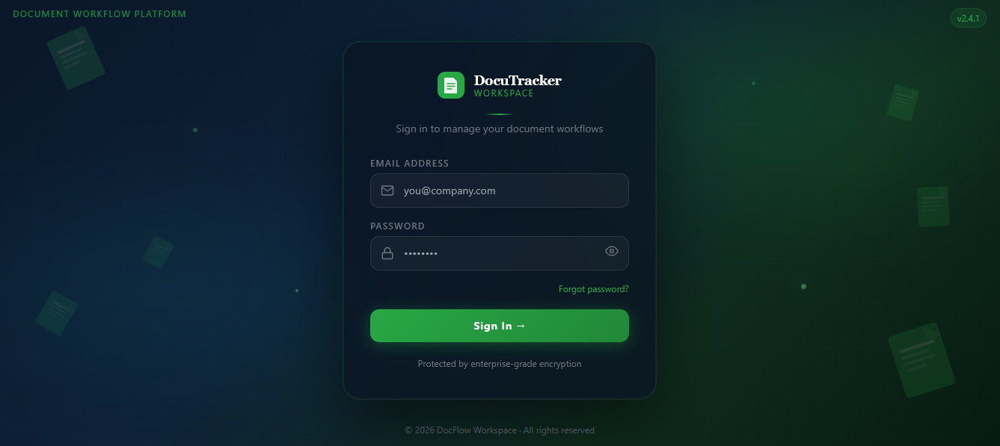

# DocuTracker
Live demo: https://docutracker.onrender.com 

**Status:** WIL Prototype — DHA Digitization Hub



DocuTracker is a full stack workflow tracking system built for document dha
digitization environment — task assignment, tracking staff
performance, and providing **AI-powered guidance** where it matters most.

---

## The Problem

During my WIL at the DHA Digitization Hub, I observed that:

- Tasks move through multiple stages with **no centralized tracking**
- Errors were corrected through **verbal interventions**, not systems
- Managers had **no visibility** into staff performance or efficiency
- Accountability was difficult without structured progress data

---

## The Solution

DocuTracker brings structure to digitization workflows:

1. Managers input tasks via a simple interface
2. **n8n automation** assigns tasks based on:
   - Staff availability
   - Error rates
   - Efficiency scores
3. Staff receive assignments and update progress in real time
4. Managers get a **live dashboard** with performance insights
5. An **AI assistant** guides users through the system at every step

 Result: **Less manual overhead. More accountability. Smarter workflows.**

---

## Core Features

-  Task CRUD with real-time status updates
-  Role-based access for managers and staff
-  Automated task assignment via n8n workflows
-  Efficiency & performance tracking (completion time, error rates)
-  AI assistant (ChatGPT) for workflow guidance and support
-  Notifications triggered on status changes

---

## Tech Stack

- **Frontend:** HTML, CSS, JavaScript, Bootstrap
- **Backend:** Node.js, Express.js
- **Database:** MySQL
- **Automation:** n8n, JavaScript & Python scripts
- **AI / Chatbot:** ChatGPT API

---

##  System Architecture
```
Manager → Task Input → Task Completion → Efficiency Metrics → Manager Dashboard
                                              → (Optional) AI Assistant
```

Decoupled layers for task logic, automation, AI, and performance tracking.
Modular and extensible by design.

---

## Status

Prototype built during WIL — demonstrates workflow analysis, task automation,
and AI integration in a real digitization environment. Not yet in production.

---

## Author

Lekoloane Nape Percy
Computer Science Graduate
